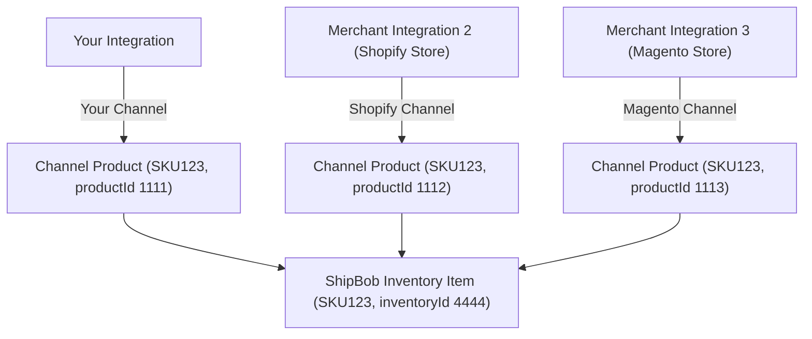
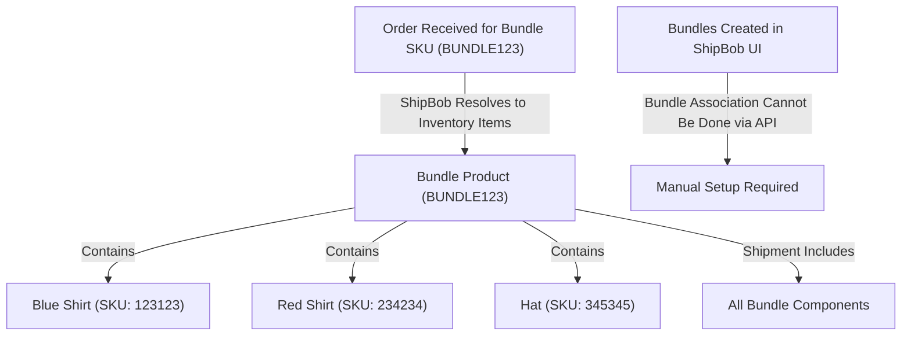

## Creating channel products

A product in ShipBob is a fulfillable item that will exist on orders and shipments. To create a product via the ShipBob API, this can be handled either by [creating a single product](https://developer.shipbob.com/api-docs#tag/Products/paths/~11.0~1product/post), or creating products [in bulk](https://developer.shipbob.com/api-docs#tag/Products/paths/~11.0~1product~1batch/post). There are two required fields to successfully create a product in ShipBob, as well as a recommended optional field:

* **Reference\_id** (required) – this is typically the product SKU or it can be another unique identifier. ShipBob highly recommends to use a product’s SKU value for this field. When viewing a product in ShipBob’s UI, the reference\_id API field translates the UI **SKU** value.

* **Name** (required) – this is the name of the product.

* **Barcode** (optional, recommended) – the product’s barcode. This is very useful to have available as it assists the receiving process when inbound inventory is sent to a ShipBob facility to be stowed.

## Managing channel products

When creating a product under the channel that you have write access to, you are creating a channel product, or a digital representation of a physical good. A channel product will be associated with an inventory item, which is the physical representation of that good that holds inventory levels and other item attributes. Since a channel product is a digital representation, it is possible for that same item to exist across various different channels.

As an example, if your integration creates a channel product “SKU123”, the merchant could also be connected between ShipBob and other integrations, such as Shopify, BigCommerce, Magento, NetSuite, etc. Each of these integrations manages their own channel products, so “SKU123” could be a channel product for each of those integrations as well. Each channel product will resolve to the same **inventory item**, which is the item that is visible in the ShipBob UI. As a result, despite multiple channel products for the same item existing, you will only see the one inventory item when searching for “SKU123” in the ShipBob UI:

### **Bundle considerations**

A bundle on ShipBob is a product that resolves to multiple inventory items. This is most commonly used for gift or multi packs. When an order is received for this product, the shipment will contain all the inventory items associated with the bundle. Note: The association of a product to bundle can currently only be done from the ShipBob UI.

Bundles are a way to associate multiple pre-defined SKUs with specific quantities within an order.

For example, an example merchant might have a bundle called Bundle A, which correlates to:

> x1 Blue Shirt - SKU = 123123x1 Red Shirt - SKU = 234234x1 Hat - SKU = 345345

The bundle itself also has its own SKU, such as BUNDLE123.

There are two primary options for handling bundles via ShipBob API.

<Accordion title="Option 1 – Deconstruct bundle prior to sending to ShipBob (preferred)" defaultOpen={false}>
  ShipBob ultimately needs all products at the variant/component level as this is what ShipBob fulfillment centers pack shipments with.

  If the upstream system that is integrating with ShipBob is able to deconstruct bundles into the component SKUs prior to sending to ShipBob, ShipBob will also return the component SKUs within the fulfillment data, so the upstream system may need to also reconstruct bundles based on the capabilities of the system, how inventory is calculated, or other merchant requirements.

  This option means that bundles would not need to be maintained in ShipBob directly, as ShipBob will only create products at the component level. This is more user friendly for the merchant as they will not need to manually convert a product to be a bundle, or create bundles via the ShipBob dashboard.
</Accordion>

<Accordion title="Option 2 – Construct bundle prior to sending to ShipBob" defaultOpen={false}>
  In ShipBob, bundles can be created directly in the UI from a product. A product can be marked as a Bundle, and then a merchant is able to breakdown the component SKUs that make up that bundle.

  The ability to mark the product as a bundle is not available with an API request, so if bundles will be maintained within ShipBob directly, the merchant will need to manually update a product to be a bundle and ensure that all component SKUs are correctly associated with the bundle product. [Here is a tutorial](https://support.shipbob.com/en/articles/3967384-bundle-items) on managing bundles in ShipBob.

  Once correctly configured in ShipBob, the integration would be able to send the specific bundle SKU, and ShipBob fulfillment centers will ship all products comprising that bundle.

  Considerations with this option:

  1. If a bundle SKU is sent in an Order POST to ShipBob, retrieving that order data will return the bundle SKU. The component SKUs will not be returned in an Order GET response, but the **inventory ids** of the component products will be returned.

  2. Inventory quantities in ShipBob are tracked at the component level, not at the bundle level. You will need to conduct inventory level calculations for the bundle as a result.
</Accordion>

### 

### 