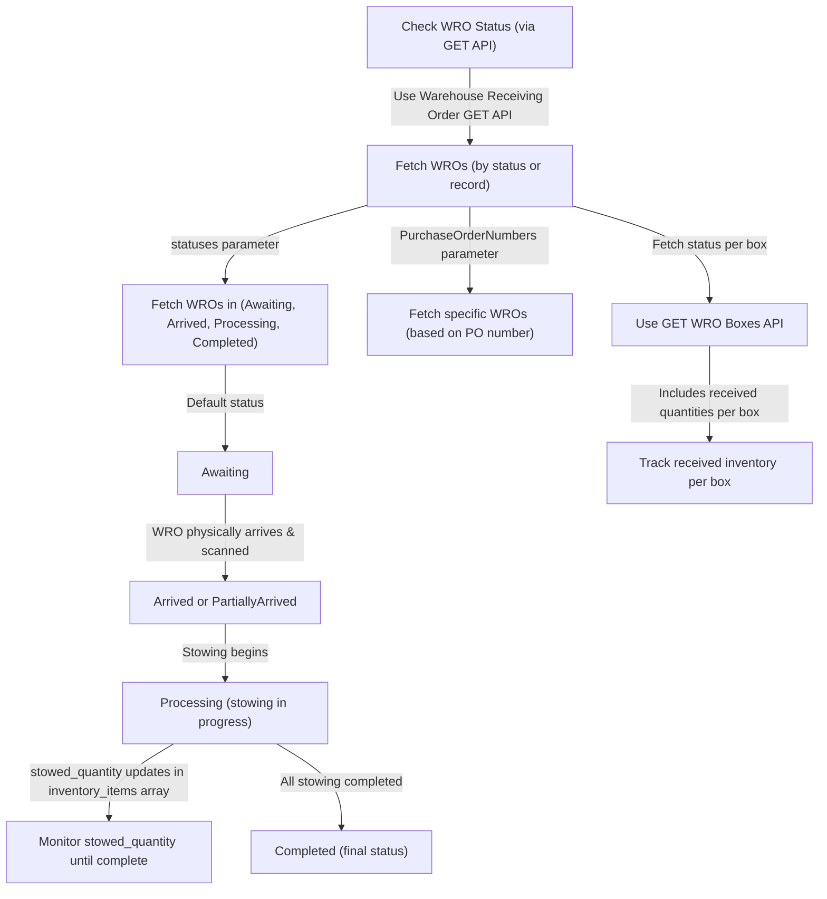

## Creating warehouse receiving orders

ShipBob’s inbound receiving process comes in the form of Warehouse Receiving Orders (WROs). A WRO can be created via the ShipBob API.

### Relevant ShipBob APIs:

* [Warehouse Receiving Order POST](https://developer.shipbob.com/api-docs/#tag/Receiving/paths/~12.0~1receiving/post)

* [Warehouse Receiving Order GET](https://developer.shipbob.com/api-docs/#tag/Receiving/paths/~12.0~1receiving/get)

* [Box Labels GET](https://developer.shipbob.com/api-docs/#tag/Receiving/paths/~12.0~1receiving~1%7Bid%7D~1labels/get)

* [Product POST](https://developer.shipbob.com/api-docs/#tag/Products/paths/~11.0~1product~1batch/post)

* [Product GET](https://developer.shipbob.com/api-docs/#tag/Products/paths/~11.0~1product/get)

### Details on WRO Creation

The [WRO POST request](https://developer.shipbob.com/api-docs/#tag/Receiving/paths/~12.0~1receiving/post) requires several fields to be populated based on how the inbound will be sent to ShipBob.

* The package\_type field accepts the values of **Pallet**, **Package**, and **FloorLoadedContainer**

  * Pallet – if the inbound order is palletized, please include the Pallet tracking number and the contents of the pallet as a “box” within the ShipBob box array. If multiple pallets are being sent, please separate each pallet as its own “box” in the box array.

  * Package – please provide the package contents for each package/parcel being sent as part of that purchase order. Each package should have its own tracking number. Please note that a maximum of 50 “boxes” within the box array are allowed per WRO request.

  * Floor Loaded Container – please provide the entire contents of the container as one “box” within the box array and the container’s tracking number.

* The expected arrival date must be a date in the future, otherwise the WRO creation request will fail, and you will receive a 400 response with a description stating that the arrival date must be in the future.

* The ShipBob inventory\_id (a unique ShipBob product identifier) is also a requirement for the WRO record to be created successfully. As a result, product records must first exist within the ShipBob WMS prior to the WRO request being sent to ShipBob. There are several strategies to accomplish this:

  * The recommended approach is for the integration to first check, via the Product GET API, if products within an inbound already exist within the WMS. If they do, the associated inventory\_ids can be used in the WRO creation request. If they do not, they can be created via a Product POST request, and the request response will include the inventory\_id.

  * The alternative approach is to store the ShipBob inventory\_id upstream whenever a product is created via the integration.

* The purchase order number field should be populated with a unique PO number or shipment number.

* Provide the scannable carton ID in the tracking\_number field for each box/pallet that the ShipBob operations team can physically scan when the WRO arrives at the warehouse.

### Details on WRO Status Updates

ShipBob’s GET Warehouse Receiving Order API will allow an on-demand fetch of WROs within a ShipBob account and the current status associated with each individual WRO.

Several parameters can be used to fetch WROs by status or by specific WRO record:

* The “statuses” parameter can be used to fetch WROs that are in various statuses, such as Arrived, Processing, Completed.

  * When a WRO is first created, the status will default to “Awaiting”. Once the WRO has physically arrived at the warehouse and has been scanned by the Operations team, the status will update to “Arrived” or “PartiallyArrived”.

  * A Completed status means that all stowing has been completed and no further action will be taken against the WRO record.

  * A Processing status means that stowing is taking place; the “stowed\_quantity” field within the “inventory\_items” array will continually increase until stowing is complete for a product.

* The PurchaseOrderNumbers parameter can return specific WRO records associated with the purchase order numbers passed during the WRO creation.

Depending on the use-case, the integration can continuously poll a WRO and monitor the “stowed\_quantity” for each product as the stowing occurs during the WRO’s Processing status, or wait until the WRO is in Completed status before updating inventory in the upsteam platform.

Additionally, the [GET WRO Boxes](https://developer.shipbob.com/api-docs/#tag/Receiving/paths/~12.0~1receiving~1%7Bid%7D~1boxes/get) endpoint can be used to fetch the status for each box individually, which will also include the received quantities per box.

### 

### Assumptions & Considerations

* WRO configuration updates are not supported via the ShipBob API. There is no API endpoint to update a WRO once it has been created.