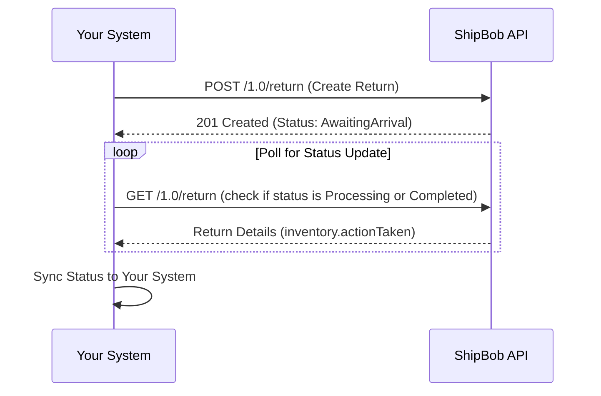
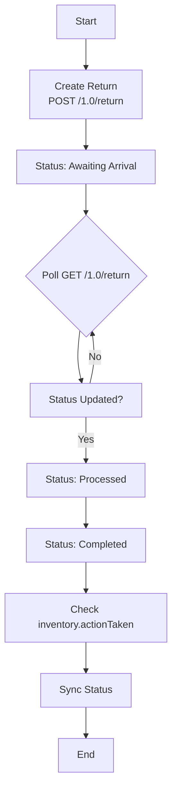

A **return** in ShipBob refers to a request to process inventory being sent back to their fulfillment centers, typically for customer refunds or exchanges. ShipBob manages the physical handling of returned items, but refunds or exchanges are handled by your system.

The **`referenceId`** field is key—it’s a unique identifier from your system that links the return in ShipBob to your records, ensuring easy tracking and reconciliation.



##

<Accordion title="Prerequisites" defaultOpen={false}>
  To get started, you’ll need:

  1. **ShipBob Sandbox Account:** Sign up at [ShipBob's sandbox signup page](https://developer.shipbob.com/).

  2. **Personal Access Token:** Generate this in the ShipBob dashboard under **Integrations > API Tokens**. Alternatively, use OAuth2 by submitting [this form](https://developer.shipbob.com/) twice (sandbox and production).

  3. **Channel ID:** Fetch this with a `GET` request to [`https://sandbox-api.shipbob.com/1.0/channel`](https://sandbox-api.shipbob.com/1.0/channel) using your token. Look for a channel starting with "Personal Access Token..." and note its `id`.

  4. **Inventory IDs:** Identify the `inventoryId` values for items being returned.
</Accordion>

***

## Creating a Return

Use the **Create Return Order** endpoint to start a return:

* **Endpoint**: `POST `[`https://sandbox-api.shipbob.com/1.0/return`](https://sandbox-api.shipbob.com/1.0/return) (switch to `api.shipbob.com` for production)

* **Authentication**: Add your Personal Access Token in the `Authorization` header or use OAuth2.

* **Header**: Include `shipbob_channel_id` with your channel ID.

### Request Body

The request body is a JSON object with these fields:

| Field            | Type   | Required? | Description                                                                              |
| ---------------- | ------ | --------- | ---------------------------------------------------------------------------------------- |
| `referenceId`    | String | Yes       | Your system’s unique identifier (e.g., "REDO\_RETURN\_12345") to track the return.       |
| `inventory`      | Array  | Yes       | List of items being returned, each with an `inventoryId` and optional `requestedAction`. |
| `trackingNumber` | String | No        | Carrier tracking number for the return shipment—helps ShipBob identify it faster.        |

* **`inventory` Details**:

  * Each object represents one type of item.

  * Use each `inventoryId` only once per return.

  * Optional `requestedAction` values: `Default`, `Restock`, `Quarantine`, or `Dispose`.

### Example Request

<Tabs>
  <TabItem label="JSON">
    ```json
    {
      "referenceId": "TEST_RETURN_12345",
      "inventory": [
        {
          "inventoryId": 12232,
          "requestedAction": "Restock"
        },
        {
          "inventoryId": 12039,
          "requestedAction": "Dispose"
        }
      ],
      "trackingNumber": "1Z9999W99999999999"
    }
    ```
  </TabItem>
</Tabs>

* **Notes**:

  * `referenceId`: Links to "TEST\_RETURN\_12345" in your system.

  * `inventory`: Two items returned in one box.

  * `trackingNumber`: Speeds up processing at ShipBob.

### Key Rules

* **One Box, One Return**: Each physical shipment needs its own return order.

* **No Duplicates**: Each `inventoryId` must appear only once in the `inventory` array.

* **Physical Items Only**: Exclude digital items or bundles.

***

## Handling Responses

### Success Response

A `201 Created` status indicates success:

<Tabs>
  <TabItem label="JSON">
    ```json
    {
      "id": 98765,
      "referenceId": "TEST_RETURN_12345",
      "status": "Awaiting Arrival",
      "inventory": [
        {
          "inventoryId": 12232,
          "requestedAction": "Restock",
          "actionTaken": null
        },
        {
          "inventoryId": 12039,
          "requestedAction": "Dispose",
          "actionTaken": null
        }
      ],
      "trackingNumber": "1Z9999W99999999999",
      "createdDate": "2025-10-15T10:00:00Z"
    }
    ```
  </TabItem>
</Tabs>

* `id`: ShipBob’s internal return ID.

* `status`: Starts as "Awaiting Arrival."

* `actionTaken`: Filled after inspection (e.g., "Restock" or "Dispose").

### Error Responses

* **400 Bad Request**: Invalid data (e.g., duplicate `inventoryId`).

* **401 Unauthorized**: Missing or invalid authentication.

***

## Best Practices

1. **Unique `referenceId`**: Make it immutable and traceable in your system.

2. **Add `trackingNumber`**: Optional but accelerates processing.

3. **One Return per Box**: Match returns to physical shipments.

4. **Choose Actions Carefully**: Set `requestedAction` based on merchant needs.

5. **Test in Sandbox**: Use a Shopify dev store to sync products and orders.

***

## Monitoring Returns

Track returns with the **Get Return Orders** endpoint:

* **Endpoint**: `GET `[`https://sandbox-api.shipbob.com/1.0/return`](https://sandbox-api.shipbob.com/1.0/return)

* **Parameters**: Filter by `referenceId`, `status`, or `id`.

### Statuses

* **Awaiting Arrival**: Return is inbound; can be modified or canceled.

* **Processed**: Inspection underway; no changes allowed.

* **Completed**: Processing done; no further edits.

### Quality Grading

* **`requestedAction`**: Your requested outcome (e.g., "Restock").

* **`actionTaken`**: ShipBob’s final action post-inspection (e.g., "Dispose" if defective).

***

## Diagrams

### 1. Sequence Diagram: Creating a Return


Monitoring return status

