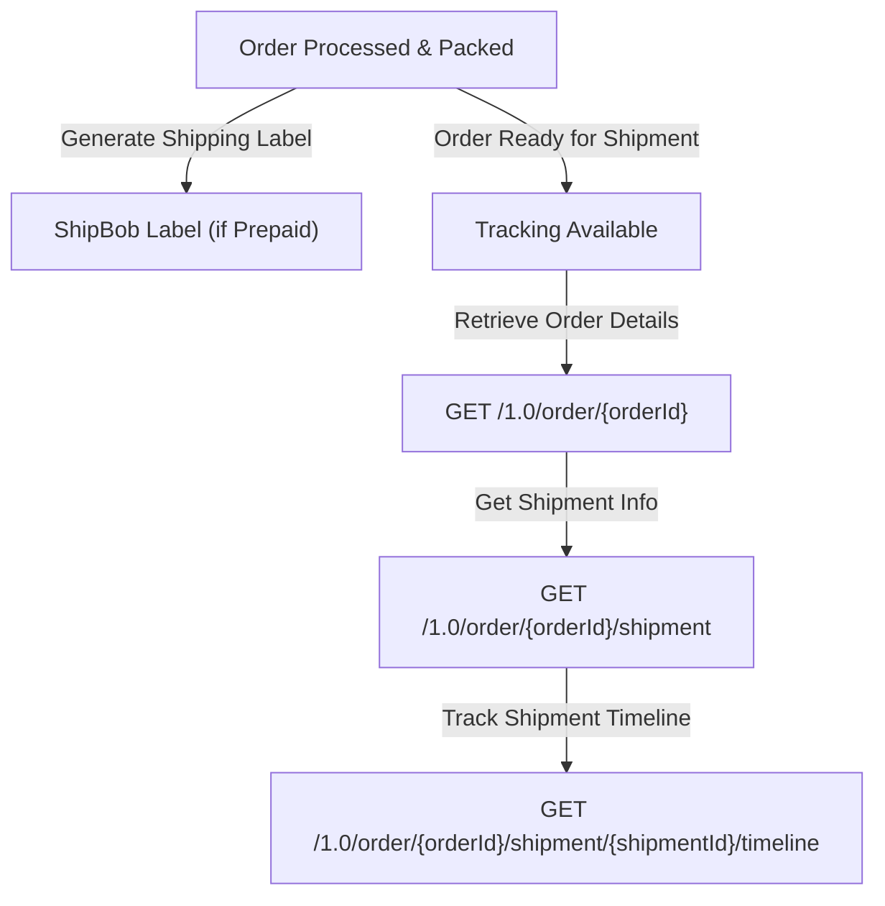

## Retrieving tracking and fulfillment details

There are two primary options for retrieving shipment details from ShipBob.

### Option 1 – Polling-based approach

This method allows you to fetch tracking details from ShipBob on demand using the [GET Orders](https://developer.shipbob.com/api-docs#tag/Orders/paths/~11.0~1order/get) endpoint. There are several parameters to choose from depending on your use case, but the most common params used are:

* **LastUpdateStartDate** and **LastUpdateEndDate** – this allows you to implement a sliding time window so that you fetch only newly updates orders since the time you last checked ShipBob.

* **HasTracking** – this will filter orders only where tracking information has been made available (i.e. the order has shipped).

You also can specify a **`shipbob_channel_id`** header parameter. It is advised to pass this parameter for the channel you have write access to, so you only retrieve order and shipment details from orders that were created from your integration. Excluding the channel id will be a global search across all channels for the Merchant, which has the possibility to retrieve order details from other sources/integrations a merchant has installed that you may not need.

If your platform supports split orders/shipments, you will need to refer to the multiple shipment objects returned in the API response in the event that an order has been split.

Within the order response, you will see an array of shipments (please refer to the sample response in the documentation linked above). An order can have a one-to-many relationship to shipments if the order has been split. Each shipment associated with an order will have a unique tracking number and will detail which products have been packed and shipped as part of that individual shipment.

Each shipment will also have a status. When a shipment has tracking details, the shipment status will be “LabeledCreated”. This status will quickly move to “Completed”. If you have a use-case that requires you to look at specific ShipBob statuses, it is recommended to use both statuses when checking for tracking details from ShipBob.

To see more detail on other statuses you may encounter, please refer to our documentation [here](https://developer.shipbob.com/).

### Option 2 – Webhooks

ShipBob has the ability to fire webhooks for certain shipment events. The topics that can be subscribed to are:

* Shipped event

* Delivery event

* Shipment exception event (such as a product being out of stock)

* Shipment On Hold event (such as an invalid address)

* Shipment cancelled event

Each topic can be subscribed to individually via a webhook POST request. Request details can be found [here](https://developer.shipbob.com/api-docs#tag/Webhooks/paths/~11.0~1webhook/post). ShipBob also has several example payloads on the webhook page of our documentation [here](https://developer.shipbob.com/webhooks).

A couple critical pieces to note:

* The Shipped topic will include a payload that is identical to the Order GET response detailed in method one above. In the event of a split shipment, you will receive multiple events when each individual shipment of an order has been shipped, which is when the shipment status has been updated to **LabeledCreated**.

* ShipBob uses an exponential backoff approach to deliver a webhook event to your endpoint for up to 24 hours. However, ShipBob cannot guarantee the delivery of retried events in the order in which they were originally generated. Therefore, if you have implemented a webhook solution that expects events to be delivered in a specific sequence, it is highly advised that you have a method in place to handle these events.