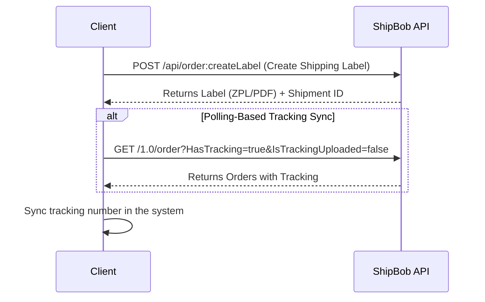

This API lets you create shipping labels, sync tracking numbers, and handle batches for orders processed through ShipBob’s logistics system. It’s straightforward to integrate and works in both sandbox and production environments.

## Getting Started

### Create an Account

To get started, you’ll need a ShipBob account. Reach out to your ShipBob representative to set one up—they’ll guide you through the process and provide the necessary credentials.

## Label Endpoints

