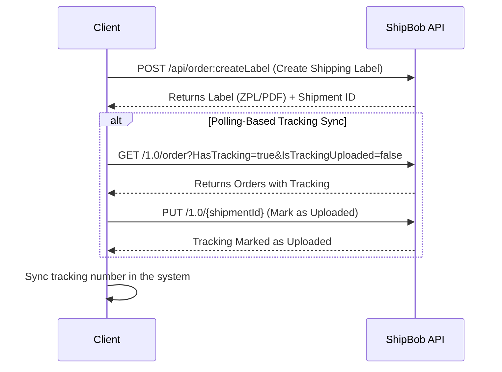

This API lets you create shipping labels and sync tracking numbers for orders processed through ShipBob’s logistics system. It’s straightforward to integrate and works in both sandbox and production environments.



## Getting Started

### Create an Account

To get started, you’ll need a ShipBob account. Reach out to your ShipBob representative to set one up—they’ll guide you through the process and provide the necessary credentials.

## Base URLs

### Sandbox (Testing)

* **UI**: [`https://logisticslabelprintingui-stage.shipbob.dev/`](https://logisticslabelprintingui-stage.shipbob.dev/)

* **API**: [`https://logisticslabelprintingapi-stage.shipbob.dev/`](https://logisticslabelprintingapi-stage.shipbob.dev/)

### Production (Live)

* **UI**: [`https://logisticslabelprintingui.shipbob.com/`](https://logisticslabelprintingui.shipbob.com/)

* **API**: [`https://logisticslabelprintingapi.shipbob.com/`](https://logisticslabelprintingapi.shipbob.com/)

## Authentication

Authentication depends on the API you’re calling:

<Accordion title="For logisticslabelprintingapi Endpoints">
  For `https://logisticslabelprintingapi-stage.shipbob.dev/` or `https://logisticslabelprintingapi.shipbob.com/`:\
  Use an `SBL_authToken` provided by your ShipBob rep.

  ```json
  Authorization: <SBL_authToken>
  ```
</Accordion>

<Accordion title="For sandbox-api or api.shipbob.com Endpoints">
  For `https://sandbox-api.shipbob.com/` or `https://api.shipbob.com/`:\
  Use a Personal Access Token (PAT), which you can generate in the ShipBob dashboard.

  ```json
  Authorization: <Personal_Access_Token>
  ```
</Accordion>

## Create a Shipping Label

Generate a shipping label for an order. Labels default to ZPL format, but you can request PDF by adding a `Label-Type` header.

### Endpoint

* **Sandbox**: `POST `[`https://logisticslabelprintingapi-stage.shipbob.dev/api/order:createLabel`](https://logisticslabelprintingapi-stage.shipbob.dev/api/order:createLabel)

* **Production**: `POST `[`https://logisticslabelprintingapi.shipbob.com/api/order:createLabel`](https://logisticslabelprintingapi.shipbob.com/api/order:createLabel)

### Headers

| Header          | Value             | Required? | Description                       |
| --------------- | ----------------- | --------- | --------------------------------- |
| `Authorization` | `<SBL_authToken>` | Yes       | Your SBL authentication token     |
| `Label-Type`    | `application/pdf` | No        | Set to get a PDF label (optional) |

### Request Body

Send a JSON object with order details:

```json
{
  "order": {
    "shipping_method": "Standard",
    "recipient": {
      "name": "Test Test",
      "email": "johndoe@shipbob.com",
      "address": {
        "address1": "120 N Racine",
        "address2": null,
        "company_name": null,
        "city": "Chicago",
        "state": "IL",
        "country": "US",
        "zip_code": "60607"
      },
      "phone_number": "444-333-2222"
    },
    "location_id": 8,
    "reference_id": "101",
    "measurements": {
      "total_weight_oz": 4,
      "length_in": 2,
      "width_in": 4,
      "depth_in": 6
    }
  },
  "meta": {
    "order_number": "101",
    "order_id": "101",
    "customer_name": "ABC Merch"
  }
}
```

#### Key Fields

* `shipping_method`: The shipping option (e.g., "Standard").

* `recipient`: Details about the recipient.

* `location_id`: ShipBob location ID (integer).

  * **Note**: In sandbox, always use `location_id: 8` for testing. In production, contact your ShipBob rep to get your specific `location_id`.

* `reference_id`: Your unique order identifier.

* `measurements`: Package dimensions and weight.

* `meta`: Extra info for your records.

### Response

On success (HTTP 200):

```json
{
  "interim_order_id": "temp-123",
  "reference_id": "101",
  "shipment_id": 456,
  "label": "<label_data>"
}
```

* `label`: ZPL string or PDF data (based on `Label-Type`).

#### Error Responses

* `400`: Bad request (check your JSON).

* `401`: Invalid or missing `SBL_authToken`.

* `500`: Server issue—try again later.

## Sync Tracking Numbers

Sync tracking numbers back to your system using the polling-based approach.

Manually check for tracking updates.

<Steps>
  <Step title="Fetch Orders with Tracking">
    * **Endpoint**: `GET `[`https://sandbox-api.shipbob.com/1.0/order?HasTracking=true&IsTrackingUploaded=false`](https://sandbox-api.shipbob.com/1.0/order?HasTracking=true\&IsTrackingUploaded=false)

    * **Optional Parameter**: Add `&limit=250` for up to 250 results.

    * **Header**:`Authorization: Bearer <Personal_Access_Token>`

    * **Response Example**:

    ```json
      [
        {
          "id": 234567890,
          "reference_id": "101",
          "shipments": [
            {
              "id": 12345678,
              "tracking_number": "1Z9999W99999999999"
            }
          ]
        }
      ]
    ```

    ####
  </Step>

  <Step title="Iterate through each order">
    * Each order has 1 shipment with ShipBob Logistics
  </Step>

  <Step title="Sync Tracking">
    * Extract the `tracking_number` from the shipments array and update your system.
  </Step>

  <Step title="Mark as Uploaded">
    * **Endpoint**: `PUT https://sandbox-api.shipbob.com/1.0/{shipmentId}`

    * **Header**:`jsonAuthorization: <Personal_Access_Token>`

    * **Body**:

    ```json
      {
        "is_tracking_uploaded": "true"
      }
    ```

    * Replace `{shipmentId}` with the shipment ID (e.g., `12345678`).
  </Step>

  <Step title="Repeat">
    * Poll every 30 minutes to stay updated.
  </Step>
</Steps>


## Tips for Success

* Test in the sandbox first (use `location_id: 8` for label creation).

* Generate your Personal Access Token in the ShipBob dashboard for `sandbox-api` or `api.shipbob.com` calls.

* Contact your ShipBob rep for your production `location_id` or if you hit a 401 error with your `SBL_authToken`.

* Poll every 30 minutes to avoid missing tracking updates.